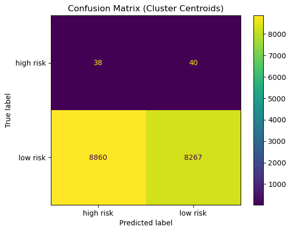
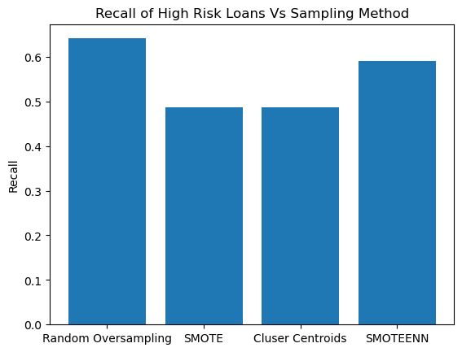

# Credit-Risk-Analysis
Predicted credit risk using BalancedRandomForestClassifier and EasyEnsembleClassifier

## Overview

This project analyzes credit risk data from a lending company. The goal is to compare different sampling techniques and machine learning methods for predicting whether a given loan is high or low risk. The data has the issue of class-imbalance, since the vast majority of the loans are low risk and only a small minority are high risk. Can resampling mitigate this issue? And which machine learning techniques best detect high risk loans? 

## Results

Four types of resampling methods were used on the data: Random Oversampler, SMOTE oversampling, Cluster Centroids, and SMOTEENN. The first two methods employ oversampling, the third uses undersampling, and the last combines undersampling and oversampling. After each resampling, logistic regression was applied to the data.

The confusion matrix shows the performance of logistic regression with Cluster Centroids. The confusion matrices from the other techniques are very similar. Notice that the algorithm is identifying many low risk loans as high risk loans, resulting in a low accuracy. However, when a loan is high risk, the algorithm has a 50% of making the right choice. This recall would likely be lower if it were not for the bias towards classifying loans as high risk. In a practical setting, misidentiyfing low risk loans as high risk may be a necessary trade-off if it means a high chance of properly identifying a high risk loan. Regardless, the model is still performing poorly, which is the case with the other sampling techniques as well.

The bar chart displays the recall from each technique for high risk loans. Precision and F1 scores were roughly the same across techniques (around 0.01 each), so these were not plotted. Overall, random sampling performed the best, with a recall of 0.64. In other words, when a loan is high risk, logistic regression will identify it as such 64% of the time. This only slightly better than randomly guessing (50%). Along with the low precision and F1 scores, it is evident that the logistic regression is performing poorly despite the use of resampling.

## Summary

Oversampling performed the best when pair with logistic regression. However, all models performed poorly. Therefore, none of these models are recommended for real-world use. Applying different kinds of models, such as neural networks, may perform better with these resampling techniques, and would provide further insight. 

